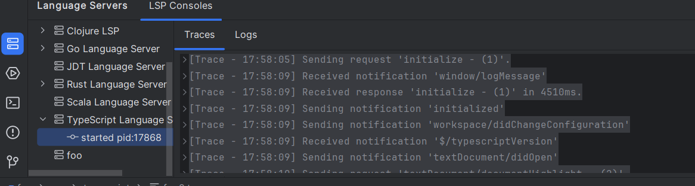

[LSP4IJ](https://plugins.jetbrains.com/plugin/23257-lsp4ij) is a new, free and open-source LSP client for JetBrains-based IDEs, compatible with both **community** and enterprise flavors.

It provides outstanding features such as:
- The ability to [configure LSP servers without developing a new plug-in](https://github.com/redhat-developer/lsp4ij/blob/main/docs/UserDefinedLanguageServer.md) (restricted to stdio-based connections for the moment).
- A [set of API allowing third-party adopters to contribute LSP extensions](https://github.com/redhat-developer/lsp4ij/blob/main/docs/DeveloperGuide.md) to the JetBrains ecosystem
- a [console view](https://github.com/redhat-developer/lsp4ij/blob/main/docs/UserGuide.md#lsp-console), allowing users to monitor and troubleshoot the communication between the IDE and the LSP servers.

The client already supports a significant amount of [features](https://github.com/redhat-developer/lsp4ij/blob/main/docs/LSPSupport.md) from the LSP 3.17 specification, and more are on their way.

## Why LSP4IJ?

The Devtools team at Red Hat has been working on free and open-source language servers for *many* years. We have offered Language Server Protocol (LSP) implementations for [Java](https://github.com/eclipse/eclipse.jdt.ls/), [YAML](https://github.com/redhat-developer/yaml-language-server), [XML](https://github.com/eclipse/lemminx), [MicroProfile](https://github.com/eclipse/lsp4mp), [Quarkus](https://github.com/redhat-developer/quarkus-ls) and [Qute](https://github.com/redhat-developer/quarkus-ls/tree/master/qute.ls), that were integrated into Visual Studio Code via several extensions. Some of those language servers have also been integrated into Eclipse IDE.

By 2019, JetBrains already provided some Quarkus support in IntelliJ IDEA Ultimate to their paid customers. But when Red Hat wanted to bring the same awesome Quarkus tools VS Code already had, to the wider IntelliJ IDEA Community, an LSP client for IntelliJ was needed.

At that time, we evaluated [Ballerina's lsp4intellij library](https://github.com/ballerina-platform/lsp4intellij), which provides advanced LSP support but has the following limitations:
 * Quarkus / Qute language servers have a complicated mechanism, delegating parts of the work to the IDE's Java support (JDT for Eclipse and Psi for IntelliJ), to avoid parsing Java classes twice (once by the language server, another the built-in Java support). We encountered numerous freezes.
 * Ballerina implements certain LSP features without reusing IntelliJ built-in extension points (ex: hover, go to declaration)
 * Tracing server status (starting, started, stopping, stopped) is difficult, which makes server startup issues hard to troubleshoot.
 * Ballerina features are mostly based on a Timeout system, which stops LSP requests after a defined time.

To integrate our Quarkus and Qute language servers, the LSP support in IntelliJ needed to:

 * never freeze, even when the language server cannot be started.
 * not rely on a timeout system, but instead properly manage LSP request cancellations (when the file is modified for example)
 * provide a UI allowing easy tracking of the state of the language servers
 * provide an LSP console that displays LSP traces and server logs.

For these reasons, we developed the LSP support we needed directly within the [`Quarkus Tools for IntelliJ`](https://github.com/redhat-developer/intellij-quarkus/) plugin. It actually started as a port of the [`Eclipse LSP4E`](https://github.com/eclipse/lsp4e) project. It took us several years, but we ended up with an LSP support that was mature and efficient.

In 2023, JetBrains finally decided to [start providing some LSP support](https://blog.jetbrains.com/platform/2023/07/lsp-for-plugin-developers/), but to only make it available in their commercial products, which was a not a good fit for us as we couldn't use it for `Quarkus Tools`. It was also lacking some features we really, really, liked in our LSP client, notably the LSP Consoles view.

Seeing our own LSP support held up pretty well for Quarkus and Qute, we decided to extract it into its own standalone project, to provide generic LSP support, for all JetBrains products, notably the community ones. Hence LSP4IJ was born.

## LSP support overview

### LSP features

LSP4IJ implements basic LSP features like `completion`, `validation`, `hover`, `go to definition`, but also more advanced ones, such as `codelens`, `inlay hints`, `quickfixes`, `rename`, `signature help` and others. 

Here's a quick example showcasing the [`gopls`](https://pkg.go.dev/golang.org/x/tools/gopls) language server in action:


The [LSP Support](https://github.com/redhat-developer/lsp4ij/blob/main/docs/LSPSupport.md) page provides a complete overview of what LSP4IJ supports and details how it leverages specific IntelliJ extension points. While most features work out-of-the-box, a few [cases](https://github.com/redhat-developer/lsp4ij/blob/main/docs/DeveloperGuide.md#special-cases) require special configuration.

#### Cancellation Support

In order to avoid using timeouts (that might still freeze the IDE), LSP4IJ implements [Cancellation Support](https://microsoft.github.io/language-server-protocol/specifications/lsp/3.17/specification/#cancelRequest) to stop LSP requests when the file changes or when the IDE indicates the some requests (e.g. completion) are no longer relevant.

### LSP consoles view

Although not often useful to users, the [LSP consoles view](https://github.com/redhat-developer/lsp4ij/blob/main/docs/UserGuide.md#lsp-console) is extremely valuable when one needs to troubleshoot issues with the language servers. All servers can be configured to log traces, as simple or verbose messages. This console view is similar to Visual Studio Code's Output view, only more convenient, as message contents are collapsible:


## Installation

LSP4IJ requires at least Java 17 and IntelliJ-based IDEs 2023.2 at the moment.

The LSP4IJ plugin is available in the stable channel of the [JetBrains Plugin Repository](https://plugins.jetbrains.com/plugin/23257-lsp4ij).

## Quickly get started with LSP4IJ

If you want to *quickly test your language server with LSP4IJ without having to develop a plugin* or *if you're unfamiliar with IntelliJ plugin development*, LSP4IJ offers the possibility of integrating any language server (**only stdio mode is supported at the moment**) with [simple settings](https://github.com/redhat-developer/lsp4ij/blob/main/docs/UserDefinedLanguageServer.md) where you only need to define:

 * the language server `launch command`
 * the `mapping` between the `language server` and the `files` targeted by the language server

### Example: Adding TypeScript support

Free/community IntelliJ-based IDEs only provide basic support for `TypeScript` in the form of syntax highlighting. In this section, we'll explain step-by-step how to integrate the [TypeScript language server](https://github.com/typescript-language-server/typescript-language-server) into your IntelliJ IDE, without having to develop anything, and immediately benefit from `TypeScript`, `React` and `JavaScript` support (completion, validation, quickfixes, codelens, etc):


#### Step 1: Install the language server

This step describes how to install the language server. In our case, `typescript-language-server` is `Node.js` application and thus requires the `Node.js` runtime to run.

You will need to:
 
* [Install `Node.js`](https://nodejs.org/en/download)
* [Install `typescript-language-server`](https://github.com/typescript-language-server/typescript-language-server?tab=readme-ov-file#installing). The simplest way is to open a terminal and execute the following command:

> npm install -g typescript-language-server typescript

It will install:

* [TypeScript language server](https://github.com/typescript-language-server/typescript-language-server): this project delegates the LSP operations (completion, diagnostics, etc) to the `tsserver` from [TypeScript](https://github.com/microsoft/TypeScript) which doesn't support LSP itself.
* [TypeScript](https://github.com/microsoft/TypeScript) which includes `tsserver`.
* As the command will add `typescript-language-server` to your OS PATH, you will probably have to close and reopen your IDE for the command to be accessible by LSP4IJ. 

#### Step 2: Create a language server in LSP4IJ

In order to create a new [User-defined language server](https://github.com/redhat-developer/lsp4ij/blob/main/docs/UserDefinedLanguageServer.md), you need to open the `New Language Server` dialog, either:

 * from the menu on the right of the LSP console:


* or with the `[+]` on the top of the language server settings:


Once you clicked on either of them, the dialog will appear:


To quickly configure TypeScript support, you could use the [TypeScript template](https://github.com/redhat-developer/lsp4ij/blob/main/docs/user-defined-ls/typescript-language-server.md) which will pre-fill all fields (command and mappings), but in order to better understand the process, let's do that manually:

##### Define launch command

In the `Server` tab, set:

 * `Name` as `TypeScript Language Server`.
 * `Command` as `typescript-language-server --stdio`


Note that you can use [macros in your commands](https://github.com/redhat-developer/lsp4ij/blob/main/docs/UserDefinedLanguageServer.md#macro-syntax), to make them more portable, should you choose to [export you server](#Export-server).

##### Define mappings

In the `Mappings > File name patterns` tab, associate `*.ts`, `*.tsx`, `*.jsx` files to the language server as shown below :


The value in the `Language Id` column must be one of the language identifiers defined in the [LSP specification](https://microsoft.github.io/language-server-protocol/specifications/lsp/3.17/specification/#textDocumentItem).

##### Define configuration

By default, `codelens` and `inlayhint` are not available in the TypeScript Language Server, you can enable them by filling the `Configuration` tab with the following JSON settings:

```json
{
  "typescript": {
    "inlayHints": {
      "includeInlayEnumMemberValueHints": true,
      "includeInlayFunctionLikeReturnTypeHints": true,
      "includeInlayFunctionParameterTypeHints": true,
      "includeInlayParameterNameHints": "all",
      "includeInlayParameterNameHintsWhenArgumentMatchesName": true,
      "includeInlayPropertyDeclarationTypeHints": true,
      "includeInlayVariableTypeHints": true,
      "includeInlayVariableTypeHintsWhenTypeMatchesName": true
    },
    "implementationsCodeLens": {
      "enabled": true
    },
    "referencesCodeLens": {
      "enabled": true,
      "showOnAllFunctions": true
    }
  }
}
```


Click the `OK` button, and you should see the `TypeScript Language Server` in the `Language Servers` view:



Create a `ts` file and open it. The `TypeScript Language Server` should start and you should now be able to use TypeScript support with completion, hover, linting...

### Using a Template

LSP4IJ provides [a few templates](https://github.com/redhat-developer/lsp4ij/blob/main/docs/UserDefinedLanguageServer.md#using-template) for various language servers. You can select the [TypeScript Language Server](https://github.com/redhat-developer/lsp4ij/blob/main/docs/user-defined-ls/typescript-language-server.md) template which will pre-fill all fields previously described (server name, command and mappings).


### Export server

If you want to share your language server settings, you can [export it](https://github.com/redhat-developer/lsp4ij/blob/main/docs/UserDefinedLanguageServer.md#exporting-templates) to generate a zip file, that, once shared and unzipped to a directory, can be [imported](https://github.com/redhat-developer/lsp4ij/blob/main/docs/UserDefinedLanguageServer.md#custom-template).

## How to integrate your language server in an IntelliJ plugin.

Manually defining a language server via settings allows you to add a language server into IntelliJ in a few minutes, but if you need to provide better integration with the IDE, embedding the language server definition in an IntelliJ plugin will be a better solution:

 * it is possible to embed the language server and/or provide a mechanism to download/update the language server, etc. make it easier for users to get started.
 * advanced language servers require implementing specific client-side commands, which is only possible through the development of an IntelliJ plugin.
 
The [Developer Guide](https://github.com/redhat-developer/lsp4ij/blob/main/docs/DeveloperGuide.md)  provides step-by-step instructions for contributing an LSP language server in your IntelliJ plugin.

The following example shows how to integrate the `TypeScript Language Server` in an IntelliJ plugin. In your plugin.xml, you would declare the server like this:

```xml
<extensions defaultExtensionNs="com.redhat.devtools.lsp4ij">
    <server id="typeScriptLanguageServerId"
            name="TypeScript Language Server"
            factoryClass="com.yourplugin.lsp.TypeScriptLanguageServerFactory">
        <description><![CDATA[
        Some description written in HTML, that will be displayed in the LSP consoles view and Language Servers settings.
        ]]>
        </description>
    </server>
</extensions>
```

and mappings like this by using [File name pattern mapping](https://github.com/redhat-developer/lsp4ij/blob/main/docs/DeveloperGuide.md#file-name-pattern-mapping):

```xml
<extensions defaultExtensionNs="com.redhat.devtools.lsp4ij">

    <fileNamePatternMapping patterns="*.ts"
                            serverId="typeScriptLanguageServerId"
                            languageId="typescript"/>

</extensions>
```

The `com.yourplugin.lsp.TypeScriptLanguageServerFactory` factory class looks like this:

```java
package com.yourplugin.lsp;

import com.intellij.openapi.project.Project;
import com.redhat.devtools.lsp4ij.LanguageServerFactory;
import com.redhat.devtools.lsp4ij.client.LanguageClientImpl;
import com.redhat.devtools.lsp4ij.server.StreamConnectionProvider;
import org.jetbrains.annotations.NotNull;

public class TypeScriptLanguageServerFactory implements LanguageServerFactory {

    @Override
    public @NotNull StreamConnectionProvider createConnectionProvider(@NotNull Project project) {
        return new TypeScriptLanguageServer(project);
    }

}
```

```java
package com.yourplugin.lsp;

import com.redhat.devtools.lsp4ij.server.ProcessStreamConnectionProvider;

import java.util.List;

public class TypeScriptLanguageServer extends ProcessStreamConnectionProvider {

    public MyLanguageServer() {
        List<String> commands = List.of("typescript-language-server", "--stdio");
        super.setCommands(commands);
    }
}
```

This code assumes `typescript-language-server` is available on the PATH, but it could be improved to target an embedded TypeScript language server inside your IntelliJ plugin.

## Conclusion

This article only scratches the surface of what `LSP4IJ` provides. You can find more documentation in:

 * [the user guide](https://github.com/redhat-developer/lsp4ij/tree/main/docs/UserGuide.md), describing how to use the LSP consoles view and Language Server preferences.
 * [the LSP Support overview](https://github.com/redhat-developer/lsp4ij/tree/main/docs/LSPSupport.md), detailing which LSP features are implemented, and how.
 * [the User-defined language server documentation](https://github.com/redhat-developer/lsp4ij/tree/main/docs/UserDefinedLanguageServer.md), explaining how to integrate a language server in LSP4IJ with minimal settings. 
 * [the developer guide](https://github.com/redhat-developer/lsp4ij/tree/main/docs/DeveloperGuide.md), providing step-by-step instructions on how to integrate a language server in LSP4IJ in an external IntelliJ plugin.

Creating a new LSP client for JetBrains-based IDEs has been a very humbling and rewarding experience. With each new language server we tested, we found slightly different behaviors to account for, eventually making LSP4IJ more and more robust. 
The initial feedback from the community has been very encouraging so far. We hope you will find LSP4IJ useful!

If you find any bugs or can think of ideas for some great new features, please don’t hesitate to head over to our Github repository and [open a ticket](https://github.com/redhat-developer/lsp4ij/issues). Since our test framework is built around [LSP requests](https://github.com/redhat-developer/lsp4ij/blob/main/src/test/java/com/redhat/devtools/lsp4ij/features/completion/GoCompletionTest.java), you just need to copy traces from the LSP Consoles view so we can reproduce issues you find with your language server and fix them.
