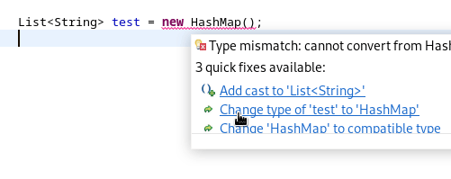
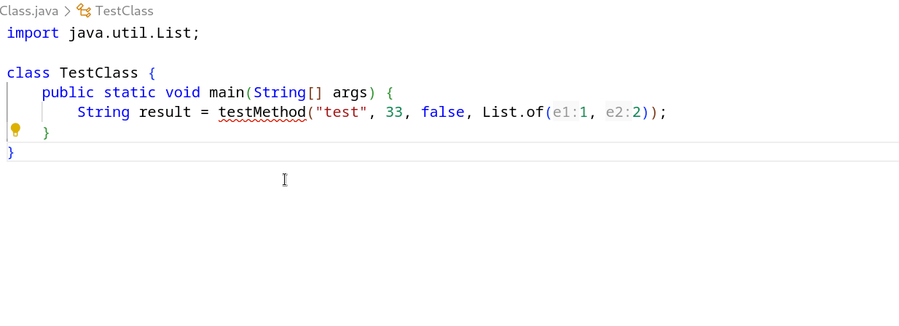

I'm definitely not the first developer to say that quick fix suggestions make my life ten times easier. With dynamic proposals for code actions, my life gets even easier.

Many quick fixes have multiple suggestions for text replacement. In the Eclipse IDE, these are displayed in a dropdown selection menu. Take a look at the type mismatch quick fix below, for example:

Very helpful, right? Now let's take a look at how VS Code handles the same quick fix:

No dropdown, no options, just the first item from Eclipse's list inserted statically. Definitely less helpful.

Why is this? Well, code actions in Eclipse support dropdown choices, as well as placeholders, which enable dynamic text insertion/replacement. Code actions in VS Code, on the other hand, do not. The closest we can get to simulating this behaviour in VS Code is by using snippets, which similarly have choices/placeholders. Unfortunately, we couldn't support snippet strings in code actions without violating the [Language Server Protocol](https://microsoft.github.io/language-server-protocol/) specification... until now!

With the introduction and support of SnippetTextEdit in [LSP](https://microsoft.github.io/language-server-protocol/specifications/lsp/3.18/specification/#snippetTextEdit) and [VS Code](https://code.visualstudio.com/api/references/vscode-api#SnippetTextEdit), dynamic code actions will now be supported in the upcoming release of vscode-java 1.35.0! If you can't wait, they're also available now in pre-release.

Check out the relevant [PR](https://github.com/redhat-developer/vscode-java/pull/3730) in [vscode-java](https://github.com/redhat-developer/vscode-java) and its supporting [PR](https://github.com/eclipse-jdtls/eclipse.jdt.ls/pull/3229) in [JDT-LS](https://github.com/eclipse-jdtls/eclipse.jdt.ls).

## The Point

Code actions, which were once completely static, now prompt you to alter relevant sections of text and give you multiple suggestions for insertion and replacement.

Pretty cool.

## Limitations

This improvement doesn't come without a few minor setbacks. 

For code actions that propose new types, the import for the selected type cannot be automatically resolved. Instead, after applying the code action and selecting the new type from the dropdown, the user has to either manually import the type, apply the subsequent quick fix suggestion to import the type, or issue the 'Organize Imports' command (`Shift` + `Alt` + `O`). 

Additionally, any code action that involves multi-line text insertion will see additional indentation on all lines excluding the first one. You can see this happen in the above example. This is due to a [bug](https://github.com/microsoft/vscode/issues/63129) in VS Code that automatically adds indentation to snippet strings.
