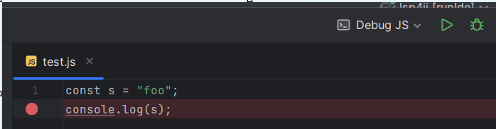

[LSP4IJ](https://plugins.jetbrains.com/plugin/23257-lsp4ij) is a free and open-source Language Server Protocol (LSP) client for JetBrains-based IDEs, compatible with both **community** and enterprise flavors.

Since the article [Meet LSP4IJ, a new LSP Client for JetBrains-based IDEs](https://idetools.dev/blog/lsp4ij-announcement/) was written, LSP support has improved considerably:

 * implementation of new LSP features, such as support for LSP 
[On Type Formatting](https://github.com/redhat-developer/lsp4ij/blob/main/docs/LSPSupport.md#on-type-formatting)
[Semantic Tokens](https://github.com/redhat-developer/lsp4ij/blob/main/docs/LSPSupport.md#semantic-tokens),
[Call Hierarchy](https://github.com/redhat-developer/lsp4ij/blob/main/docs/LSPSupport.md#call-hierarchy), 
[Type Hierarchy](https://github.com/redhat-developer/lsp4ij/blob/main/docs/LSPSupport.md#type-hierarchy),
[Document Symbol](https://github.com/redhat-developer/lsp4ij/blob/main/docs/LSPSupport.md#document-symbol)
[Workspace Symbol](https://github.com/redhat-developer/lsp4ij/blob/main/docs/LSPSupport.md#workspace-symbol), etc.
 * [LSP API client features](https://github.com/redhat-developer/lsp4ij/blob/main/docs/LSPApi.md) that allows plugin adapters to customize the LSP features.

The latest version of LSP4IJ includes all of these improvements to LSP support, but what sets it apart from other releases 
is that it provides a new, free and open-source [Debug Adapter Protocol](https://microsoft.github.io/debug-adapter-protocol/) (DAP) client for JetBrains-based IDEs, compatible with both **community** and enterprise flavors.

# LSP support improvement

Here is a list of some LSP improvements. To know in detail all the improvements, it is recommended to read the 
[LSP support](https://github.com/redhat-developer/lsp4ij/blob/main/docs/LSPSupport.md) section.

## LSP features

LSP hover now supports syntax coloration for markdown code blocks :


LSP on type formatting is now supported:


LSP selection range is now supported:


LSP workspace symbol is now supported:


LSP call hierarchy is now supported:


## User defined Language Server

Server configuration is done with a JSON editor that can be associated with a JSON schema
to provide validation, completion, and hovering when editing the server configuration:


# Debug Adapter Protocol (DAP)

[LSP4IJ's DAP support](https://github.com/redhat-developer/lsp4ij/blob/main/docs/dap/UserGuide.md) 

 * allows to connect to the DAP server via `stdio` and `socket` 
 * and handle both types of request `launch` and `attach`.

Here is a list of DAP servers that have been tested to implement this DAP support:

| DAP Server                                                                                                                      | stdio | socket | launch | attach |
|---------------------------------------------------------------------------------------------------------------------------------|-------|--------|--------|--------|
| [Go Delve DAP server](https://github.com/redhat-developer/lsp4ij/blob/main/docs/dap/user-defined-dap/go-delve.md)               |       | X      | X      |        |
| [Julia DAP server](https://github.com/redhat-developer/lsp4ij/blob/main/docs/dap/user-defined-dap/julia.md)                     |       | X      | X      |        |
| [Python Debugpy DAP server](https://github.com/redhat-developer/lsp4ij/blob/main/docs/dap/user-defined-dap/python-debugpy.md)   |       | X      |        | X      |
| [Swift DAP Server](https://github.com/redhat-developer/lsp4ij/blob/main/docs/dap/user-defined-dap/swift-lldb.md)                | X     |        | X      |        |
| [VSCode JS Debug DAP Server](https://github.com/redhat-developer/lsp4ij/blob/main/docs/dap/user-defined-dap/vscode-js-debug.md) |       | X      | X      |        |

## VSCode JS Debug

Takes a sample with vscode js debug

To debug JavaScript or TypeScript files, you can use the [VSCode JS Debug](https://github.com/microsoft/vscode-js-debug) DAP server.

Let’s debugging the following `test.js` file:

```js
const s = "foo";
console.log(s);
```



### Configure DAP server

1. Download the `js-debug-dap-v*.tar.gz` asset from the [VSCode JS Debug releases](https://github.com/microsoft/vscode-js-debug/releases).  
   For example, download [js-debug-dap-v1.96.0.tar.gz](https://github.com/microsoft/vscode-js-debug/releases/download/v1.96.0/js-debug-dap-v1.96.0.tar.gz), which is the latest version at the time of writing.

2. Extract the archive into any folder (e.g., `/home/path/to/dap`). The extracted folder should contain the DAP server at `/js-debug/src/dapDebugServer.js`.

3. Create a DAP Run/Debug configuration:

   

4. In the `Server` tab, click on `create a new server`:

   

5. It opens a new dialog to create DAP server, select `VSCode JS Debug` template:
   

6. After clicking on `OK` button, it will select the new server and pre-fill configurations:


This will automatically populate:

* the server `name`
* the `command` which starts the DAP server which should look like this:

```
node <<insert base directory>>/js-debug/src/dapDebugServer.js ${port} 127.0.0.1
```

Replace `<<insert base directory>>` with the directory  (e.g., `/home/path/to/dap`) where you extracted the DAP server. For example:

```
node /home/path/to/dap/js-debug/src/dapDebugServer.js ${port} 127.0.0.1
```

The `${port}` argument will be replaced with a free port when the run configuration starts.

* the `Connect to the server by waiting` option is set to `Log pattern before processing` with:

 ```
 Debug server listening at
```

This means the DAP (Debug Adapter Protocol) client will connect to the DAP server when this trace appears in the console:

```
node /home/path/to/dap/js-debug-dap-v1.96.0/js-debug/src/dapDebugServer.js 56425 127.0.0.1
Debug server listening at 127.0.0.1:56425
```

5. Enable DAP server traces

If you wish to show DAP request/response traces when you will debug:


you need to select `Trace` with `verbose`.


### Configure file mappings

To allows settings breakpoints to JavaScript, TypeScript, etc files, you need configure mappings in the `Mappings` tab.
As you have selected `VSCode JS Debug` server, it will automatically populate the file mappings like this:


### Configure the JavaScript file to run/debug

1. Fill in the `Configuration` tab:

- the `working directory` (usually the project's root directory)
- the path to the `test.js` file.


2. Select `Launch` as `Debug mode`.
3. The DAP parameters of the launch should look like this:

```json
{
   "type": "pwa-node",
   "name": "Launch JavaScript file",
   "request": "launch",
   "program": "${file}",
   "cwd": "${workspaceFolder}"
}
```

When the run configuration starts:

- `${workspaceFolder}` will be replaced with the working directory you specified.
- `${file}` will be replaced with the full path to `test.js`.

#### Set Breakpoint

After applying the run configuration, you should set a breakpoint to files which matches file mappings.
Set a breakpoint in the `test.js` file:


#### Debugging

You can start the run configuration in either Run or Debug mode. Once started, you should see DAP traces in the console:


You will also see `Threads` and `Variables`:


### Configure the TypeScript file to run/debug

Let’s debugging the following `test.ts` file:

```ts
class Greeter {
  greeting: string;

  constructor(message: string) {
    this.greeting = message;
  }

  greet() {
    return "Hello, " + this.greeting;
  }
}

let greeter = new Greeter("world");
console.log(greeter.greet())
```


#### Compile TypeScript

Create a `tsconfig.json` file like this:

```json
{
   "compilerOptions": {
      "target": "ES6",
      "module": "CommonJS",
      "outDir": "out",
      "sourceMap": true
   }
}
```

Execute `tsc` command to generate source maps in the `out` folder:

* `test.js`
* `test.js.map`

#### Configure the TypeScript file to run/debug

Select the `Launch TypeScript file` configuration:


which will update the DAP parameters like this:

```json
{
   "type": "pwa-node",
   "name": "Launch TypeScript file",
   "request": "launch",
   "program": "${file}",
   "cwd": "${workspaceFolder}",
   "outFiles": [
      "${workspaceFolder}/**/*.(m|c|)js",
      "!**/node_modules/**"
   ],
   "sourceMaps": true,
   "__workspaceFolder": "${workspaceFolder}"
}
```

Update the path with the `test.ts` file.


#### Debugging

TypeScript debugging should be available:


## How to integrate your Debug Adapter Server in an IntelliJ plugin.

# Developer Guide

DAP support provides a [generic DAP configuration interface](https://github.com/redhat-developer/lsp4ij/blob/main/docs/dap/UserGuide.md) that allows to configure any DAP server.
The fact that it is generic can confuse the user with all the possible configurations.

To improve the user experience, it is possible to register a custom DAP server via the **experimental**
[`com.redhat.devtools.lsp4ij.debugAdapterServer` extension point](https://github.com/redhat-developer/lsp4ij/blob/main/docs/dap/DeveloperGuide.md#debugadapterserver-extension-point) which allows for example:

* to [embed the DAP server in its plugin](#embed-the-dap-server) to avoid the user to download it, to configure its environment.
* to [customize the DAP server startup](#customize-the-dap-server-startup) to avoid the user to configure it.

# TypeScript DAP server

In this example we will explain how to register [VSCode JS Debug DAP server](https://github.com/redhat-developer/lsp4ij/blob/main/docs/dap/user-defined-dap/vscode-js-debug.md)
with the `com.redhat.devtools.lsp4ij.debugAdapterServer` extension point.

## Embed the DAP server

Here we will embed the [VSCode JS Debug DAP server](https://github.com/redhat-developer/lsp4ij/blob/main/docs/dap/user-defined-dap/vscode-js-debug.md) in the plugin `my.plugin.id`.
You will need to download the `js-debug-dap-v*.tar.gz` asset from the [VSCode JS Debug releases](https://github.com/microsoft/vscode-js-debug/releases), unzip it
and copy/paste the `js-debug` folder in your `src/main/resources` folder:


## Customize the DAP server startup

Configuring manually [VSCode JS Debug DAP server](https://github.com/redhat-developer/lsp4ij/blob/main/docs/dap/user-defined-dap/vscode-js-debug.md) can be boring:

* you need to download `js-debug-dap-v*.tar.gz`, unzip it, and update the `<<insert base directory>>`
  to use the proper path of the DAP server.
* the UI configuration is little complex.


In this step we will register the DAP server with the `com.redhat.devtools.lsp4ij.debugAdapterServer` extension point.

### DebugAdapterDescriptor

Create the `TypeScriptDebugAdapterDescriptor` class like this:

```java
package my.dap.server;

import com.intellij.execution.ExecutionException;
import com.intellij.execution.configurations.GeneralCommandLine;
import com.intellij.execution.configurations.RunConfigurationOptions;
import com.intellij.execution.process.ProcessHandler;
import com.intellij.execution.runners.ExecutionEnvironment;
import com.intellij.openapi.fileTypes.FileType;
import com.redhat.devtools.lsp4ij.dap.client.LaunchUtils;
import com.redhat.devtools.lsp4ij.dap.configurations.options.FileOptionConfigurable;
import com.redhat.devtools.lsp4ij.dap.configurations.options.WorkingDirectoryConfigurable;
import com.redhat.devtools.lsp4ij.dap.definitions.DebugAdapterServerDefinition;
import com.redhat.devtools.lsp4ij.dap.descriptors.DebugAdapterDescriptor;
import com.redhat.devtools.lsp4ij.dap.descriptors.ServerReadyConfig;
import org.jetbrains.annotations.NotNull;
import org.jetbrains.annotations.Nullable;

import java.nio.file.Path;
import java.util.Map;

import static com.redhat.devtools.lsp4ij.dap.descriptors.DebugAdapterDescriptorFactory.getDebugAdapterServerPath;

public class TypeScriptDebugAdapterDescriptor extends DebugAdapterDescriptor {

    private static final String PLUGIN_ID = "my.plugin.id";

    private final static Path dapServerPath;

    static {
        dapServerPath = getDebugAdapterServerPath(PLUGIN_ID, "js-debug/src/dapDebugServer.js");
    }

    public TypeScriptDebugAdapterDescriptor(@NotNull RunConfigurationOptions options,
                                            @NotNull ExecutionEnvironment environment,
                                            @Nullable DebugAdapterServerDefinition serverDefinition) {
        super(options, environment, serverDefinition);
    }

    @Override
    public ProcessHandler startServer() throws ExecutionException {
        String command = "node " + dapServerPath.toString() + " ${port} 127.0.0.1";
        GeneralCommandLine commandLine = createStartServerCommandLine(command);
        return startServer(commandLine);
    }

    @Override
    public @NotNull Map<String, Object> getDapParameters() {
        // language=JSON
        String launchJson = """                
                {
                  "type": "pwa-node",
                  "name": "Launch TypeScript file",
                  "request": "launch",
                  "program": "${file}",
                  "cwd": "${workspaceFolder}",
                  "outFiles": [
                    "${workspaceFolder}/**/*.(m|c|)js",
                    "!**/node_modules/**"
                  ],
                  "sourceMaps": true,
                  "__workspaceFolder": "${workspaceFolder}"
                }
                """;
        String file = ((FileOptionConfigurable) options).getFile();
        String workspaceFolder = ((WorkingDirectoryConfigurable) options).getWorkingDirectory();
        LaunchUtils.LaunchContext context = new LaunchUtils.LaunchContext(file, workspaceFolder);
        return LaunchUtils.getDapParameters(launchJson, context);
    }

    @Override
    public @NotNull ServerReadyConfig getServerReadyConfig(@NotNull DebugMode debugMode) {
        return new ServerReadyConfig("Debug server listening at ");
    }

    @Override
    public @Nullable FileType getFileType() {
        return null;
    }
}
```

### DebugAdapterDescriptorFactory

Create the `TypeScriptDebugAdapterDescriptorFactory` class like this:

```java
package my.dap.server;

import com.intellij.execution.runners.ExecutionEnvironment;
import com.redhat.devtools.lsp4ij.dap.configurations.DAPRunConfigurationOptions;
import com.redhat.devtools.lsp4ij.dap.descriptors.DebugAdapterDescriptor;
import com.redhat.devtools.lsp4ij.dap.descriptors.DebugAdapterDescriptorFactory;
import org.jetbrains.annotations.NotNull;

public class TypeScriptDebugAdapterDescriptorFactory extends DebugAdapterDescriptorFactory {

    @Override
    public DebugAdapterDescriptor createDebugAdapterDescriptor(@NotNull DAPRunConfigurationOptions options, 
                                                               @NotNull ExecutionEnvironment environment) {
        return new TypeScriptDebugAdapterDescriptor(options, environment, getServerDefinition());
    }
}
```

### debugAdapterServer extension point

Register the `TypeScriptDebugAdapterDescriptorFactory` class with the `debugAdapterServer` extension point like this:

```xml
<extensions defaultExtensionNs="com.redhat.devtools.lsp4ij">
    <debugAdapterServer
        id="typescript"
        name="TypeScript"
        factoryClass="my.dap.server.TypeScriptDebugAdapterDescriptorFactory" />
</extensions>
```

### Test your debugAdapterServer

At this step, you can test your `TypeScriptDebugAdapterDescriptorFactory` with the generic Debug Adapter Protocol runconfiguration.
You should see TypeScript in the existing server,


Select it, select the TypeScript file that you wish to run in the Configuration tab and run the configuration.
It should start your DAP server and execute the TypeScript file.

# Conclusion

This article gives an overview of the new [DAP support](https://github.com/redhat-developer/lsp4ij/blob/main/docs/dap/UserGuide.md) of LSP4IJ.

It allows to configure any DAP server with 
[DAP configuration type](https://github.com/redhat-developer/lsp4ij/blob/main/docs/dap/UserGuide.md#dap-configuration-type). 

The [DAP template system](https://github.com/redhat-developer/lsp4ij/blob/main/docs/dap/UserGuide.md#templates) 
allows to pre-fill the configuration fields for a given DAP server.

Feel free to contribute to LSP4IJ to add other templates like [vscode-js-debug template](https://github.com/redhat-developer/lsp4ij/tree/main/src/main/resources/dap/templates/vscode-js-debug)

It also allows to integrate a DAP server via the **experimental**
[`com.redhat.devtools.lsp4ij.debugAdapterServer` extension point](https://github.com/redhat-developer/lsp4ij/blob/main/docs/dap/DeveloperGuide.md#debugadapterserver-extension-point)
